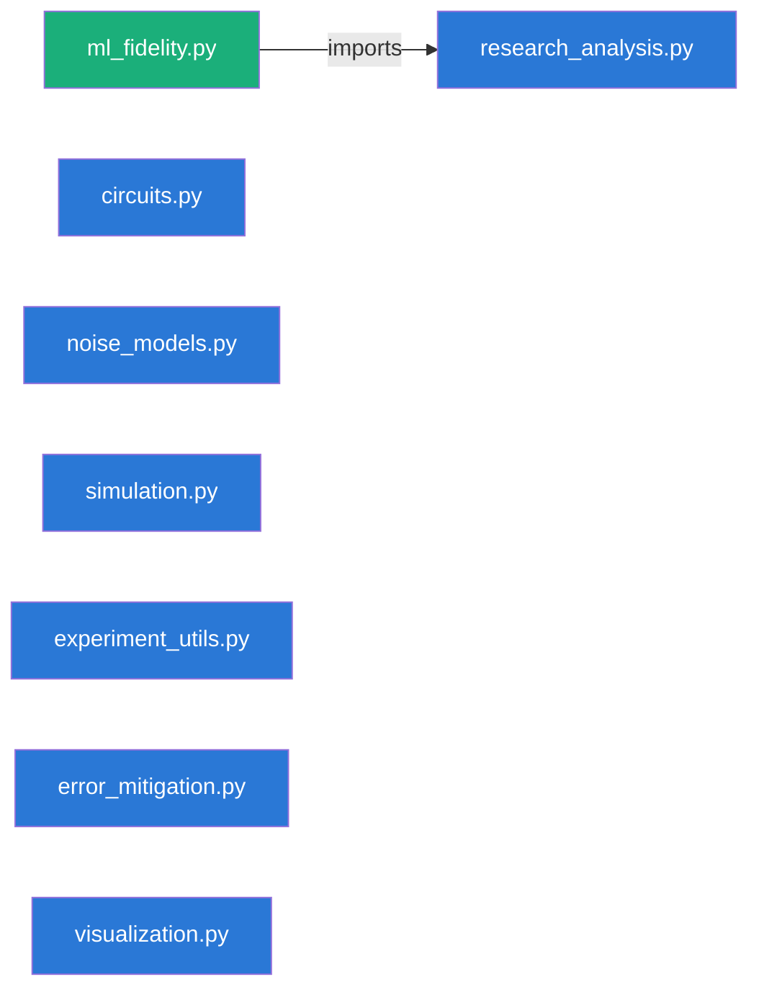
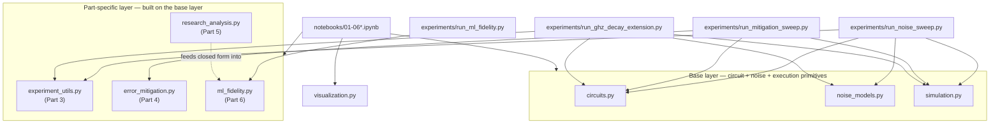
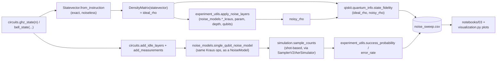
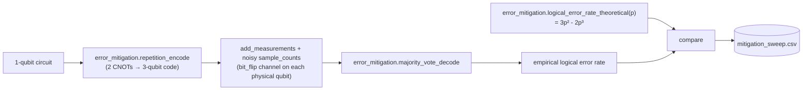
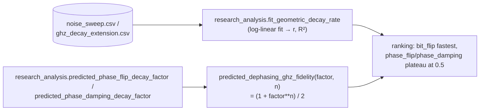
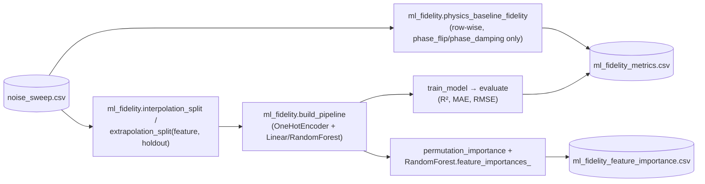

# Architecture

A system map of `quantum-noise-lab`: what was built, the math/QC background it assumes, how
data moves through it end to end, and why the code is organized the way it is. This is the
connective-tissue document — it does not re-derive results already worked out elsewhere.

## How to use this document

- **§2 (Narrative)** and **§6 (Structure)** are the fast overview — read these first if you
  need to re-orient after time away from the repo.
- **§3 (Basics)** is a dense concept-to-code index, not a tutorial. It assumes the linear
  algebra/probability background described in `CLAUDE.md` and points at exactly where each
  concept is used, rather than re-teaching it.
- **§4-5 (Architecture, Data flow)** explain *why* the modules are shaped the way they are and
  *how* one parameter value travels from a config file to a plot.
- **§7 (Module reference)** is the API surface, one section per `src/*.py` file.
- For full derivations, treat this doc as an index into three deeper sources, and don't
  duplicate them here:
  - `docs/interview_questions.md` — Q&A log with full math derivations, organized by Part (Q1-Q26).
  - `docs/mini_research_question.md` — Part 5 results write-up.
  - `docs/ml_fidelity_report.md` — Part 6 results write-up.

## 1. What this project demonstrates

Six parts plus a scaffold milestone, each shipped as `src/` code → a teaching notebook → an
interview Q&A entry, in that order (see §4 for why). Together they demonstrate: building and
reasoning about entangled states, modelling physical noise as CPTP maps from first principles,
running config-driven reproducible sweeps, implementing (and correctly scoping the limits of) a
minimal error-mitigation scheme, deriving a mechanistic explanation for an experimental
observation, and honestly benchmarking an ML model against that mechanistic explanation.

## 2. Project narrative

- **Milestone 0 — Scaffold.** Repository skeleton, `requirements.txt`, `pyproject.toml`, pytest
  config. No science yet; establishes the project as installable (`pip install -e .`) and
  testable from the start.
- **Part 1 — Qiskit fundamentals.** `src/circuits.py` builds Bell states, GHZ states, and
  uniform/arbitrary superpositions as pure `QuantumCircuit` objects. Establishes measurement via
  the Born rule, and entanglement detection via reduced density matrices (notebook 01).
- **Part 2 — Quantum noise models.** `src/noise_models.py` implements five single-qubit noise
  channels as explicit Kraus operators (bit flip, phase flip, depolarizing, amplitude damping,
  phase damping), each verified against Qiskit's built-in `noise.errors` via `SuperOp` equality
  in `tests/test_noise_models.py`. Notebook 02 visualizes each channel's effect on the Bloch
  sphere.
- **Part 3 — Noise comparison experiments.** `src/experiment_utils.py` generalizes single-shot
  noise application to a qubit-count × depth × channel × parameter sweep. `experiments/run_noise_sweep.py`
  runs this sweep config-driven and writes `experiments/results/noise_sweep.csv` — the dataset
  every later part (5 and 6) builds on. Notebook 03 discusses fidelity/success/error trends.
- **Part 4 — Simple error mitigation.** `src/error_mitigation.py` implements the 3-qubit
  bit-flip repetition code and majority-vote decoding, with an explicit theoretical logical
  error rate `3p²-2p³`. Notebook 04 demonstrates the mitigation and its phase-flip blind spot
  (see §7 for why encoding-by-CNOT can't protect a phase).
- **Part 5 — Mini research question.** "Which noise channel destroys GHZ-state fidelity fastest,
  and why?" `src/research_analysis.py` fits an empirical geometric decay rate and derives closed
  forms for the two diagonal (dephasing) channels. Answer: bit-flip decays fastest; phase-flip
  and phase-damping don't decay to 0 at all — they plateau at fidelity 1/2 (`docs/mini_research_question.md`).
- **Part 6 (optional) — ML fidelity prediction.** `src/ml_fidelity.py` frames fidelity
  prediction as regression on the Part 3 sweep, and asks the harder question — does a model
  learn the *trend*, not just interpolate the grid — via held-out extrapolation splits, scored
  against the Part 5 physics closed form as a non-ML reference point
  (`docs/ml_fidelity_report.md`).

## 3. Required basics — math bridge

Concept → precise statement → where it's used in `src/`. Full derivations are in
`docs/interview_questions.md` (linked per item); this table only fixes notation and the
code-level anchor.

| Concept | Statement | Used in |
|---|---|---|
| **State vector & Hilbert space** | A pure $n$-qubit state is a unit vector $\lvert\psi\rangle \in \mathbb{C}^{2^n}$; a global phase $e^{i\theta}\lvert\psi\rangle$ is physically indistinguishable from $\lvert\psi\rangle$, but a *relative* phase between basis-state amplitudes is observable (Q2). | `circuits.py` (all builders return state vectors implicitly via gate sequences) |
| **Gates as unitary operators** | A gate is a unitary $U$ ($U^\dagger U = I$) acting linearly on $\mathbb{C}^{2^n}$; composition is matrix multiplication in circuit order. | `circuits.py` (`bell_state`, `ghz_state`, `uniform_superposition` are fixed gate sequences) |
| **Measurement & the Born rule** | Measuring in the computational basis yields outcome $x$ with probability $\lvert\langle x\vert\psi\rangle\rvert^2$ — a projection-valued measure (Q3). | `simulation.py: theoretical_probabilities`, `sample_counts` |
| **Density matrices & mixed states** | $\rho = \sum_i p_i \lvert\psi_i\rangle\langle\psi_i\rvert$ generalizes pure states to statistical mixtures; $\mathrm{Tr}(\rho^2) = 1$ iff pure. Reduced density matrices ($\mathrm{Tr}$ over a subsystem) expose entanglement that a global statevector alone hides (Q4). | `simulation.py: bloch_vector, evolve_density_matrix` |
| **Kraus operators & CPTP maps** | Any physically valid (completely positive, trace-preserving) noise process can be written $\rho \mapsto \sum_i K_i \rho K_i^\dagger$ with $\sum_i K_i^\dagger K_i = I$ — the Stinespring-dilation representation of "unitary evolution on a larger system, then trace out the environment" (Q7, Q8). | `noise_models.py` (all five channel builders) |
| **Unital vs. non-unital channels** | Unital channels ($\sum_i K_i K_i^\dagger = I$ too) leave the maximally mixed state $I/2$ fixed; amplitude damping is the one non-unital channel here — it has a preferred fixed point $\lvert 0\rangle\langle 0\rvert$ (Q9). | `noise_models.py: amplitude_damping_kraus` docstring |
| **Fidelity** | $F(\rho,\sigma) = \left(\mathrm{Tr}\sqrt{\sqrt{\rho}\sigma\sqrt{\rho}}\right)^2$, a distance-like measure on density matrices, $\in[0,1]$, $=1$ iff $\rho=\sigma$. Reported alongside (not instead of) success/error rate because it's basis-independent while success/error rate are defined relative to a chosen "valid outcome" set (Q13). | `experiments/run_noise_sweep.py` (via `qiskit.quantum_info.state_fidelity`), `research_analysis.py` |
| **Bloch sphere geometry** | A single-qubit density matrix is $\rho = \tfrac12(I + r_x X + r_y Y + r_z Z)$; $(r_x,r_y,r_z)$ is the Bloch vector, $\lVert \mathbf r\rVert = 1$ iff pure. Noise shrinks $\lVert\mathbf r\rVert$ toward the channel's fixed point. | `simulation.py: bloch_vector`, `visualization.py: plot_bloch_vector_decay` |

## 4. System architecture

**Design principle: `src/` is pure and composable; orchestration lives outside it.** Every
`src/*.py` module exposes small, individually-testable functions with no hidden state and no
side effects (no I/O, no plotting, no config parsing) — orchestration (reading a TOML config,
looping over a parameter grid, writing a CSV, calling a plotting function) is deliberately kept
in `experiments/*.py` scripts and notebooks, never duplicated inline. This is why `src/circuits.py`
only *builds* circuits (`bell_state`, `ghz_state`, ...) while `src/simulation.py` only *executes*
them — a circuit built once can be fed to noiseless statevector extraction, noisy shot sampling,
or density-matrix evolution without the builder knowing which.

**Design principle: config-driven reproducibility.** Every experiment script
(`experiments/run_*.py`) takes a TOML config path (defaulting to a checked-in
`experiments/configs/*.toml`) rather than hardcoded sweep ranges, and every stochastic call
threads a fixed `seed` (default 42) through to `SamplerV2`/`RandomForestRegressor`/
`train_test_split`. Re-running any script regenerates its `experiments/results/*.csv` exactly.

**Actual Python import graph.** Because orchestration lives outside `src/`, most `src/*.py`
modules do not import each other at all — they are independent leaves, composed at the call
site by whichever notebook or experiment script needs them. The one exception is Part 6 building
directly on Part 5's closed form:



**Composition graph — what each entrypoint actually calls.** This is the more informative view
of how the system fits together: notebooks and `experiments/run_*.py` scripts are the only
places that wire multiple `src/` modules together.



## 5. Data flow / pipelines

### Parts 1-3: circuit → noise → metrics → CSV



Fidelity is computed **exactly** via density-matrix evolution (no sampling noise); success
probability and error rate are computed **empirically** via shot sampling through an equivalent
`NoiseModel` — two independent code paths applying the same Kraus operators, cross-checked
against each other in `notebooks/03` (see Q13 for why both are reported).

### Part 4: repetition code + majority vote



### Part 5: decay-rate fit vs. closed form



### Part 6: ML regression vs. physics baseline



### Worked example — tracing one row end to end

Take one grid point from `experiments/configs/noise_sweep.toml`'s `[ghz]` block: `channel =
"bit_flip"`, `qubit_count = 4`, `param = 0.1`, `depth = 2`.

1. `experiments/run_noise_sweep.py::run_ghz_sweep` builds `circuits.ghz_state(4)` — an
   unmeasured 4-qubit `QuantumCircuit`.
2. `ideal_rho = DensityMatrix(Statevector.from_instruction(ideal_circuit))` — the exact target
   state, computed once per qubit count (outside the channel/param/depth loops).
3. `experiment_utils.apply_noise_layers(ideal_rho, noise_models.bit_flip_kraus, 0.1, 2, [0,1,2,3])`
   applies the bit-flip Kraus channel independently to each of the 4 qubits, twice (once per
   depth layer) — 8 total single-qubit channel applications — returning `noisy_rho`.
4. `state_fidelity(ideal_rho, noisy_rho)` is written to the CSV row's `fidelity` column.
5. In parallel, `circuits.add_idle_layers(ideal_circuit, 2)` then `add_measurements(...)` builds
   the measured circuit; `noise_models.single_qubit_noise_model(bit_flip_kraus(0.1), qubits=[0,1,2,3],
   gate="id")` wraps the *same* Kraus operators into a Qiskit `NoiseModel` attached to the idle
   (`id`) gates that `add_idle_layers` inserted; `simulation.sample_counts(...)` runs 4096 shots
   through `AerSimulator` via `SamplerV2`.
6. `experiment_utils.success_probability`/`error_rate` reduce those counts against
   `valid_bitstrings = {"0000", "1111"}`, filling the row's remaining two columns.
7. The row lands in `experiments/results/noise_sweep.csv`; `notebooks/03_noise_experiments.ipynb`
   loads the CSV and calls `visualization.plot_log_fidelity_vs_qubit_count`/
   `plot_purity_vs_parameter` to render it. The same CSV is later re-consumed by Part 5
   (`research_analysis.fit_geometric_decay_rate`) and Part 6 (`ml_fidelity.load_dataset`) —
   it is the one shared dataset the back half of the project builds on.

## 6. Repository structure

```
quantum-noise-lab/
├── README.md                    Quickstart, status, roadmap, license
├── CLAUDE.md                    Agent-facing project brief and working contract
├── LICENSE                      MIT
├── requirements.txt             Pinned deps (qiskit, qiskit-aer, sklearn, jupyterlab, ...)
├── pyproject.toml               Editable-install package config + pytest markers
│
├── src/                         Pure, reusable library — no I/O, no plotting, no config parsing
│   ├── circuits.py                Circuit builders (Bell, GHZ, superposition) — Part 1
│   ├── noise_models.py            Kraus-operator noise channels — Part 2
│   ├── simulation.py               Statevector/density-matrix/shot-sampling execution helpers
│   ├── experiment_utils.py        Multi-layer/multi-qubit noise application + metrics — Part 3
│   ├── error_mitigation.py        Repetition code + majority vote — Part 4
│   ├── research_analysis.py       Geometric decay fit + dephasing closed forms — Part 5
│   ├── ml_fidelity.py             ML pipeline + physics-baseline comparison — Part 6
│   └── visualization.py           Publication-quality plotting (fixed CVD-validated palette)
│
├── notebooks/                   One teaching notebook per Part, orchestrates src/ modules
│   ├── 01_qiskit_fundamentals.ipynb
│   ├── 02_noise_models.ipynb
│   ├── 03_noise_experiments.ipynb
│   ├── 04_error_mitigation.ipynb
│   ├── 05_mini_research_question.ipynb
│   └── 06_ml_fidelity_prediction.ipynb
│
├── experiments/                 Config-driven, reproducible sweep scripts
│   ├── run_noise_sweep.py         → results/noise_sweep.csv (Part 3)
│   ├── run_mitigation_sweep.py    → results/mitigation_sweep.csv (Part 4)
│   ├── run_ghz_decay_extension.py → results/ghz_decay_extension.csv (Part 5, n=7-8 extension)
│   ├── run_ml_fidelity.py         → results/ml_fidelity_metrics.csv, ...feature_importance.csv (Part 6)
│   ├── configs/                    One TOML per runner — sweep grid, shots, seed
│   └── results/                    Committed CSV outputs (regenerable, checked in for the notebooks)
│
├── figures/                     Generated plots (PNG/SVG gitignored; dir tracked via .gitkeep)
│
├── docs/
│   ├── ARCHITECTURE.md            This document
│   ├── interview_questions.md     Q1-Q26 derivations, organized by Part
│   ├── mini_research_question.md  Part 5 results write-up
│   └── ml_fidelity_report.md      Part 6 results write-up
│
└── tests/                       pytest suite mirroring src/ (one file per module except visualization)
    ├── test_circuits.py
    ├── test_noise_models.py
    ├── test_experiment_utils.py
    ├── test_error_mitigation.py
    ├── test_research_analysis.py
    └── test_ml_fidelity.py
```

## 7. Module reference

### `src/circuits.py`
Pure `QuantumCircuit` builders only — no execution or measurement-sampling logic (that's
`simulation.py`). `bell_state(bell_type, *, measure=False)` builds one of the four maximally
entangled 2-qubit states via a lookup table of (apply-Z-before-CX, apply-X-after-CX) flags;
`ghz_state(num_qubits, *, measure=False)`; `uniform_superposition(num_qubits, *, measure=False)`;
`single_qubit_superposition(theta, phi=0.0, *, measure=False)` for arbitrary Bloch-sphere states
via the `U` gate; `add_measurements(qc, qubits=None)` returns a *copy* with a classical register
and measurements appended (never mutates in place); `add_idle_layers(qc, num_layers)` appends
`barrier()` + `id()` blocks as a depth/idle-time proxy — a natural anchor for one independent
per-qubit noise application per layer.

### `src/noise_models.py`
Five CPTP channels as explicit Kraus-operator lists: `bit_flip_kraus(p)`, `phase_flip_kraus(p)`,
`depolarizing_kraus(p)` (follows Qiskit's convention — identity term included in the 4-way Pauli
mixture, verified against `qiskit_aer.noise.depolarizing_error` — see Q11 for why this changes
what "$p$" means vs. the alternative convention), `amplitude_damping_kraus(gamma)` (non-unital,
fixed point $\lvert 0\rangle\langle 0\rvert$), `phase_damping_kraus(lam)` (unital, preserves
populations exactly). `CHANNEL_KRAUS_BUILDERS` is the name→builder dict every sweep script
iterates over. `single_qubit_noise_model(kraus_ops, qubits, gate="id")` wraps a channel into a
Qiskit `NoiseModel`, attached **independently per qubit** (a loop over `qubits`, not a joint
multi-qubit error) — this independence assumption is what makes `experiment_utils.apply_noise_layers`'s
per-qubit density-matrix evolution match the shot-sampled `NoiseModel` path exactly.

### `src/simulation.py`
Execution only; targets Qiskit's modern primitives API (`qiskit_aer.primitives.SamplerV2`), not
the deprecated `execute()`/`backend.run()` pattern. `get_statevector(qc)` (raises on
measurement/reset instructions — those are non-unitary). `sample_counts(qc, shots=4096, seed=42,
noise_model=None)` — `qc` must already carry measurements from `add_measurements`; passing
`noise_model` (built from the *same* Kraus operators used for exact fidelity) is what keeps the
two Part-3 code paths consistent. `probabilities_from_counts`, `theoretical_probabilities`
(exact Born-rule probabilities from a statevector). `bloch_vector(rho)` returns
$(\mathrm{Tr}(\rho X), \mathrm{Tr}(\rho Y), \mathrm{Tr}(\rho Z))$. `evolve_density_matrix(rho,
kraus_ops)` applies $\rho \mapsto \sum_i K_i \rho K_i^\dagger$ via Qiskit's `Kraus` operator class.

### `src/experiment_utils.py`
Generalizes Part 2's single-parameter, single-layer noise demo to a qubit-count × depth sweep.
`apply_noise_layers(rho, kraus_builder, param, num_layers, qubits)` applies a single-qubit
channel independently to each qubit, `num_layers` times (`num_layers=1` reproduces notebook 02's
direct per-qubit `evolve()` calls). `success_probability(counts, valid_bitstrings)` — fraction
of shots landing in a chosen "ideal outcome" set. `error_rate` is its complement.

### `src/error_mitigation.py`
Deliberately **not** full QEC (see Q17): `repetition_encode(qc)` requires a 1-qubit input and
copies its Z-basis value onto 2 ancilla qubits via 2 CNOTs; `majority_vote_decode(counts)`
collapses raw 3-qubit counts to a 2-key `{"0": n, "1": n}` dict by majority-of-3 (never ties);
`logical_error_rate_theoretical(p) = 3p² - 2p³` = $P[\mathrm{Binomial}(3,p) \geq 2]$, the exact
probability that ≥2 of 3 physical qubits flip. Because decoding requires a direct computational-basis
measurement of all 3 physical qubits, it collapses any encoded superposition — this is a
classical-repetition-style protection of Z-basis populations, not a stabilizer code that
preserves coherence (Q17, Q18: the same scheme gives *zero* protection against phase-flip noise).

### `src/research_analysis.py`
`fit_geometric_decay_rate(qubit_counts, fidelities)` — log-linear least-squares fit of
$\mathrm{fidelity}(n) \approx A\,r^n$, returns $(r, R^2)$. Two of the five channels have Kraus
operators diagonal in the computational basis (phase-flip, phase-damping): a diagonal Kraus
operator fixes $\lvert 0\rangle\langle 0\rvert$ and $\lvert 1\rangle\langle 1\rvert$ exactly,
shrinking only the GHZ coherence term $\lvert 0\ldots0\rangle\langle 1\ldots1\rvert$ by a
per-qubit factor — $(1-2p)$ for phase-flip (`predicted_phase_flip_decay_factor`), $\sqrt{1-\lambda}$
for phase damping (`predicted_phase_damping_decay_factor`) — giving the closed form
`predicted_dephasing_ghz_fidelity(decay_factor, n) = (1 + decay_factor**n) / 2`, which can never
drop below 1/2. The other three channels have off-diagonal Kraus contributions that move
population out of the GHZ sectors entirely and genuinely drive fidelity to 0; bit-flip does so
fastest (`docs/mini_research_question.md`).

### `src/ml_fidelity.py`
Frames fidelity prediction as regression on the Part 3 sweep, but the interesting question is
generalization, not single-split $R^2$ (a 670-row grid is trivial to interpolate). `interpolation_split`
is a random train/test split stratified by `channel` — every test row sits inside the training
grid's range on every axis. `extrapolation_split(df, feature, holdout_values)` instead holds out
the *top* of one feature's range — testing whether the model learned the underlying trend or
only the training grid. `build_pipeline(model_type, seed=42, **kwargs)` wraps a
`OneHotEncoder` (categorical: `circuit`, `channel`) + passthrough numeric features
(`qubit_count`, `param`, `depth`) into a single `sklearn.Pipeline`, so every split shares one
fitted encoder rather than each being encoded alone. Two model families bracket the bias-variance
tradeoff: `LinearRegression` (high bias — cannot represent the saturating $(1+r^n)/2$ shape
derived in Part 5) vs. `RandomForestRegressor` (low bias within-grid, but piecewise-constant on
axis-aligned splits — provably cannot extrapolate past the max feature value seen in training; it
predicts the nearest leaf's training mean, see Q24). `physics_baseline_fidelity(row)` generalizes
Part 5's closed form to `depth > 1` (exponent becomes `qubit_count * depth`, confirmed against the
committed sweep) for `phase_flip`/`phase_damping` rows only (`PHYSICS_BASELINE_CHANNELS`),
returning `None` for the three non-diagonal channels rather than approximating them.

### `src/visualization.py`
Fixed, colorblind-validated categorical palette (`CATEGORICAL_COLORS`, 5 colors, never
matplotlib's default cycle) applied consistently: `#2a78d6` (blue) always means empirical/measured,
`#1baf7a` (aqua) always means theoretical/reference, across every plot in the project. Nine plot
functions, each returning a `matplotlib.axes.Axes` with an optional `save_path`:
`plot_counts_histogram`, `plot_bloch_vector_decay`, `plot_purity_vs_parameter`,
`plot_mitigation_comparison` (adds a dashed $y=x$ "no mitigation" reference and marks the $p=0.5$
crossover), `plot_log_fidelity_vs_qubit_count` (geometric decay reads as a straight line; a
plateauing channel visibly bends away — makes Part 5's population-vs-coherence distinction
visible at a glance), `plot_predicted_vs_actual`, `plot_feature_importance`,
`plot_grouped_bar_comparison`, `plot_probability_comparison`.

## 8. Testing strategy

`tests/` mirrors `src/` one-to-one (except `visualization.py`, which isn't unit tested — it's
exercised visually via the notebooks). The recurring validation pattern is **cross-checking
against an independent reference implementation**, not just asserting hand-computed expected
values:

- `test_noise_models.py` — every hand-derived Kraus channel is checked against Qiskit's own
  `qiskit_aer.noise.errors` (e.g. `depolarizing_error`) via `SuperOp` equality, since Kraus
  representations of the same channel are non-unique (Q8) and element-wise Kraus-matrix
  comparison would be the wrong test.
- `test_experiment_utils.py`, `test_research_analysis.py`, `test_ml_fidelity.py` — include
  `@pytest.mark.slow` end-to-end smoke tests that shell out to the actual `experiments/run_*.py`
  scripts and check the committed CSV output stays consistent, in addition to unit-level tests of
  individual functions (config marker declared in `pyproject.toml`).
- `test_error_mitigation.py` — majority-vote decode logic, the closed-form binomial logical
  error rate, and the phase-flip blind spot.

Standard commands: `pytest tests/` (all), `pytest tests/test_<module>.py::test_name` (single
test), `pytest tests/ -m "not slow"` (skip the script-shelling smoke tests).

## 9. Glossary

| Term | Meaning |
|---|---|
| **CPTP** | Completely positive, trace-preserving — the mathematical condition a map must satisfy to represent a physically valid quantum channel. |
| **Kraus operators** | Matrices $\{K_i\}$ with $\sum_i K_i^\dagger K_i = I$ representing a CPTP channel as $\rho \mapsto \sum_i K_i\rho K_i^\dagger$; non-unique for a given channel. |
| **Unital / non-unital** | A channel is unital if it fixes the maximally mixed state $I/2$; amplitude damping is the non-unital channel in this repo. |
| **Fidelity** | $F(\rho,\sigma)\in[0,1]$, a distance-like measure between two quantum states; $1$ iff identical. |
| **GHZ state** | $n$-qubit state $(\lvert 0\ldots0\rangle + \lvert 1\ldots1\rangle)/\sqrt2$; generalizes the Bell pair. |
| **Bell state** | Any of the 4 maximally entangled 2-qubit states ($\Phi^\pm, \Psi^\pm$). |
| **Bloch vector** | $(\mathrm{Tr}(\rho X),\mathrm{Tr}(\rho Y),\mathrm{Tr}(\rho Z))$; unit-length iff the single-qubit state is pure. |
| **Depth / layer** | A repeated application of a noise channel to every active qubit, modeling idle time or circuit depth (`add_idle_layers`, `apply_noise_layers`). |
| **Interpolation split** | Train/test split where test rows lie inside the training grid's range on every feature. |
| **Extrapolation split** | Train/test split where test rows lie outside the training range on one feature — the harder generalization test. |
| **Physics baseline** | A closed-form (non-ML) fidelity prediction, available only for the two diagonal-Kraus channels, used as a mechanistic reference point for the ML models. |

## 10. Further reading map

| Topic touched here | Go deeper in |
|---|---|
| Global vs. relative phase, Born rule, entanglement detection | `docs/interview_questions.md` Q1-Q6, `notebooks/01_qiskit_fundamentals.ipynb` |
| Kraus operators, unital/non-unital, depolarizing convention | `docs/interview_questions.md` Q7-Q11, `notebooks/02_noise_models.ipynb` |
| Repeated noise layers, fidelity vs. error rate, GHZ fragility | `docs/interview_questions.md` Q12-Q15, `notebooks/03_noise_experiments.ipynb` |
| Repetition code, why not full QEC, phase-flip blind spot | `docs/interview_questions.md` Q16-Q18, `notebooks/04_error_mitigation.ipynb` |
| GHZ decay-rate ranking, dephasing closed form | `docs/interview_questions.md` Q19-Q21, `docs/mini_research_question.md`, `notebooks/05_mini_research_question.ipynb` |
| Interpolation vs. extrapolation, tree-model limits, feature importance | `docs/interview_questions.md` Q22-Q26, `docs/ml_fidelity_report.md`, `notebooks/06_ml_fidelity_prediction.ipynb` |
